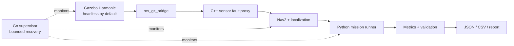

# RoboTest Lab

RoboTest Lab is a CPU-only ROS 2 software-in-the-loop platform for testing,
measuring, fault-injecting, observing, and recovering an autonomous
differential-drive robot.

> **Current status — Phase 2 verified development:** the Ubuntu 24.04 platform,
> minimal robot/world, pass-through fault proxy, bounded simulation, Nav2
> lifecycle stack, and one seeded three-waypoint mission/action integration gate
> have passing local evidence. The accepted Phase 2 run used a dirty worktree,
> so it is not release or benchmark evidence. Full Scenario 1 metrics, fault
> campaigns, recovery, packaging, and public CI remain future work.

## Why this project exists

The goal is not another “robot moves in Gazebo” example. The planned system
connects a small original Gazebo Harmonic robot and world to ROS 2 Jazzy,
Nav2, deterministic sensor-fault proxies, mission validation, measured result
artifacts, and a bounded Go process supervisor. Every result shown here must be
traceable to a command, configuration hash, and recorded run.

## Verified platform boundary

- Target environment: the WSL2 distribution named `Ubuntu`, verified as
  Ubuntu 24.04.1 LTS (Noble).
- Preserved environment: `Ubuntu-20.04` is out of scope and must never be
  changed by project scripts.
- Project root: `/home/hasan/robotest-lab` on the WSL-native filesystem.
- Runtime target: ROS 2 Jazzy, Gazebo Harmonic, Nav2, C++17, Python 3.12, and
  Go 1.22 or newer.
- Resource policy: headless by default, no GPU requirement, no Docker in the
  core workflow, at most 18 GiB projected project/dependency storage, and at
  least 20 GiB projected free space retained on the Windows host drive.

The [environment audit](docs/environment-audit.md),
[dependency plan](docs/dependencies.md),
[Phase 1 result](docs/results/phase-1/20260825T200725Z-1333.md), and
[Phase 2 result](docs/results/phase-2/20260826T010218Z-466.md) distinguish
measured evidence from planned work.

## Planned architecture



This diagram describes the approved design. The implementation now reaches the
bounded Phase 2 Nav2 mission/action gate. Metrics, fault campaigns, and the Go
supervisor remain planned and are not implied by the Phase 2 result.

## Phase 0 workflow

Run these commands only inside the verified Ubuntu 24.04 distribution. The
repository and dependency scripts reject Ubuntu 20.04.

```bash
cd /home/hasan/robotest-lab

# Read-only check. It is expected to fail until the pinned official ROS source
# package has been applied.
scripts/setup_ros2_repository.sh --check

# Explicitly configure the pinned official ROS apt source and refresh indexes.
# This is the first command in this sequence that invokes sudo or apt changes.
scripts/setup_ros2_repository.sh --apply

# Simulate the exact manifest and enforce storage/reserve gates. No package is
# installed by this command.
scripts/verify_phase0_preinstall.sh

# Install the validated direct manifest plus normal resolver-required
# dependencies, initialize rosdep, create the local tooling virtual
# environment, and run the post-install verifier.
scripts/install_dependencies.sh --apply

# Repeatable post-install verification.
scripts/verify_phase0.sh
scripts/verify_all.sh
```

Machine-readable Phase 0 results are written below
`artifacts/evidence/phase0/`. Generated evidence records what actually ran;
it must not be edited to manufacture a passing result.

## Phase 1 verification

Run the bounded automated gate inside the verified Ubuntu distribution:

```bash
cd /home/hasan/robotest-lab
taskset -c 0-5 scripts/verify_phase1.sh
```

The seeded development run `20260825T200725Z-1333` passed its build, model,
headless runtime, topic/QoS, stamp, trace, motion, resource, and artifact-hash
checks with `simulator_seed=42` and seed status
`fixed_simulator_seed_recorded`. Headline observations were 103 tests with zero
errors or failures, calculated RTF median `0.9999`, calculated RTF p5 `0.9162`,
peak launch-group RSS `795,476 KiB`, and bounded displacement `0.2962 m`. Ten
checks were skipped because `ament_cppcheck` declines cppcheck 2.13 for its
known performance issue.

Evidence:

- [full Phase 1 report](docs/results/phase-1/20260825T200725Z-1333.md)
- [compact canonical JSON](docs/results/phase-1/20260825T200725Z-1333.json)
- [matching one-row CSV](docs/results/phase-1/20260825T200725Z-1333.csv)
- [separate P1-07 RViz screenshot](docs/results/phase-1/rviz-phase1.png)

The 45-entry run checksum manifest validated completely. The headless run was
made from a dirty worktree and the RViz evidence came from a separate bounded
run, so neither is presented as a release benchmark. Fast DDS exposed live
reliability and durability but reported endpoint history/depth as
`UNKNOWN`/`0`; bounded depths retain static/source-and-test support. The contact
topic was silent, so collision absence is not established. Live TF endpoint and
edge sets were recorded, but per-edge publisher-GID attribution was unavailable.

## Phase 2 verification

Run the bounded, headless mission/action gate inside the verified Ubuntu
distribution:

```bash
cd /home/hasan/robotest-lab
ROBOTEST_SIM_SEED=42 ROBOTEST_CPUSET=0-5 scripts/verify_phase2.sh
```

The development run `20260826T010218Z-466` passed the scoped Phase 2 gate with
seed `42`, six logical CPUs (`0-5`), an empty fault schedule, and software
rendering through `llvmpipe`. Nav2 returned `SUCCEEDED` after all three ordered
waypoints. The authoritative UUID-matched action-status acceptance stamp was
`68.308 s`; the Jazzy `rclcpp_action` response stamp was retained separately as
zero/unavailable, and the terminal observation was `156.994 s`.

Headline observations were 213 tests with zero errors and failures, calculated
RTF median `0.9863`, calculated RTF p5 `0.9302`, and peak owned-process-group
RSS `1,372,244 KiB`. All 111 checksum-manifest entries validated. Source/install
binding, source/configuration non-mutation, bounded process cleanup, mission
JSON/CSV reconciliation, action ownership, command/ground-truth correlation,
and an independent post-run evidence audit passed.

Evidence:

- [full Phase 2 report](docs/results/phase-2/20260826T010218Z-466.md)
- [compact canonical JSON](docs/results/phase-2/20260826T010218Z-466.json)
- [matching one-row CSV](docs/results/phase-2/20260826T010218Z-466.csv)

This is bounded mission/action acceptance, not full Scenario 1 acceptance. The
dirty worktree makes it development evidence only. Fault injection and recovery
are not implemented or exercised, while collision count, path length, path
efficiency, and repeated-run acceptance remain deferred to Phase 3. Fast DDS
reported live history/depth as `UNKNOWN`/`0`; bounded queues retain static
source-and-test proof. Required TF edges and endpoint sets were observed, but
Jazzy callbacks did not provide per-edge publisher-GID attribution.

## Safety properties of setup

- Mutating setup scripts require an explicit `--apply` argument.
- The apt manifest is parsed as literal package-name arguments; shell
  evaluation and `xargs` interpolation are not used.
- The ROS apt-source package is pinned and SHA-256 verified before installation.
- Dependency installation is blocked if projected usage exceeds 18 GiB or
  would leave less than 20 GiB free on the Windows host drive.
- No script unregisters, exports, imports, terminates, or changes the default
  of any WSL distribution.

## Roadmap and evidence gates

| Phase | Status | Deliverable and gate |
| --- | --- | --- |
| 0 | Verified locally | Environment foundation, exact install manifest, versions, and resource gates |
| 1 | Verified development | Original robot/world, pass-through proxy, headless gates, and separate RViz evidence |
| 2 | Verified development | Bounded seeded Nav2 mission/action result, command chain, matching JSON/CSV, and global resource/isolation gates |
| 3 | Planned | Repeatable LiDAR-dropout and odometry-drift campaigns with metrics |
| 4 | Planned | Go supervisor, systemd and Debian package with lifecycle proof |
| 5 | Planned | Public CI and portfolio evidence on a documented clean commit |

## Repository layout

```text
src/                 ROS 2 packages
supervisor/          Go supervisor
scenarios/           Versioned mission and fault scenarios
config/              Shared manifests and resource policy
scripts/             Setup and evidence-producing verification
packaging/debian/    Debian packaging
tests/               Cross-package and system tests
benchmarks/          Benchmark definitions and bounded outputs
docs/                Architecture, decisions, testing, and results
artifacts/evidence/  Machine-readable verification evidence
```

## Contributing and security

See [CONTRIBUTING.md](CONTRIBUTING.md) for the evidence-first development
workflow and [SECURITY.md](SECURITY.md) for the local-only security boundary.

## License

Original RoboTest Lab code is licensed under the
[Apache License 2.0](LICENSE). Third-party software retains its own license;
see [NOTICE.md](NOTICE.md).
