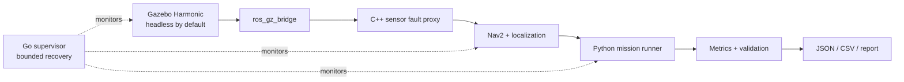

# RoboTest Lab

RoboTest Lab is a CPU-only ROS 2 software-in-the-loop platform for testing,
measuring, fault-injecting, observing, and recovering an autonomous
differential-drive robot.

> **Current status — Phase 0:** the Ubuntu 24.04 workspace and safety gates are
> being established. No robot simulation, navigation result, recovery result,
> benchmark, package, screenshot, or CI result is claimed yet.

## Why this project exists

The goal is not another “robot moves in Gazebo” example. The planned system
connects a small original Gazebo Harmonic robot and world to ROS 2 Jazzy,
Nav2, deterministic sensor-fault proxies, mission validation, measured result
artifacts, and a bounded Go process supervisor. Every result shown here must be
traceable to a command, configuration hash, and recorded run.

## Verified platform boundary

- Target environment: the WSL2 distribution named `Ubuntu`, verified as
  Ubuntu 24.04.1 LTS (Noble).
- Preserved environment: `Ubuntu-20.04` is out of scope and must never be
  changed by project scripts.
- Project root: `/home/hasan/robotest-lab` on the WSL-native filesystem.
- Runtime target: ROS 2 Jazzy, Gazebo Harmonic, Nav2, C++17, Python 3.12, and
  Go 1.22 or newer.
- Resource policy: headless by default, no GPU requirement, no Docker in the
  core workflow, at most 18 GiB projected project/dependency storage, and at
  least 20 GiB projected free space retained on the Windows host drive.

The [environment audit](docs/environment-audit.md),
[dependency plan](docs/dependencies.md), and later command transcripts are
evidence, not a promise that an unrun phase works.

## Planned architecture



This diagram describes the approved design. Components become implemented
only when their phase verifier produces passing evidence.

## Phase 0 workflow

Run these commands only inside the verified Ubuntu 24.04 distribution. The
repository and dependency scripts reject Ubuntu 20.04.

```bash
cd /home/hasan/robotest-lab

# Read-only check. It is expected to fail until the pinned official ROS source
# package has been applied.
scripts/setup_ros2_repository.sh --check

# Explicitly configure the pinned official ROS apt source and refresh indexes.
# This is the first command in this sequence that invokes sudo or apt changes.
scripts/setup_ros2_repository.sh --apply

# Simulate the exact manifest and enforce storage/reserve gates. No package is
# installed by this command.
scripts/verify_phase0_preinstall.sh

# Install the validated direct manifest plus normal resolver-required
# dependencies, initialize rosdep, create the local tooling virtual
# environment, and run the post-install verifier.
scripts/install_dependencies.sh --apply

# Repeatable post-install verification.
scripts/verify_phase0.sh
scripts/verify_all.sh
```

Machine-readable Phase 0 results are written below
`artifacts/evidence/phase0/`. Generated evidence records what actually ran;
it must not be edited to manufacture a passing result.

## Safety properties of setup

- Mutating setup scripts require an explicit `--apply` argument.
- The apt manifest is parsed as literal package-name arguments; shell
  evaluation and `xargs` interpolation are not used.
- The ROS apt-source package is pinned and SHA-256 verified before installation.
- Dependency installation is blocked if projected usage exceeds 18 GiB or
  would leave less than 20 GiB free on the Windows host drive.
- No script unregisters, exports, imports, terminates, or changes the default
  of any WSL distribution.

## Roadmap and evidence gates

| Phase | Deliverable | Required proof before advancing |
| --- | --- | --- |
| 0 | Environment and repository foundation | Exact install manifest, version inventory, resource gates |
| 1 | Minimal original robot/world and pass-through proxy | Build/tests, headless launch, topics/TF, bounded motion |
| 2 | Nav2 and deterministic waypoint mission | Action result plus matching JSON/CSV and tests |
| 3 | LiDAR dropout, odometry drift, and metrics | Repeatable fault runs and measured reports |
| 4 | Go supervisor, systemd, and Debian package | Race/vet, bounded restart, local health, install/remove proof |
| 5 | Lightweight CI and portfolio evidence | Passing public workflow on the documented commit |

## Repository layout

```text
src/                 ROS 2 packages
supervisor/          Go supervisor
scenarios/           Versioned mission and fault scenarios
config/              Shared manifests and resource policy
scripts/             Setup and evidence-producing verification
packaging/debian/    Debian packaging
tests/               Cross-package and system tests
benchmarks/          Benchmark definitions and bounded outputs
docs/                Architecture, decisions, testing, and results
artifacts/evidence/  Machine-readable verification evidence
```

## Contributing and security

See [CONTRIBUTING.md](CONTRIBUTING.md) for the evidence-first development
workflow and [SECURITY.md](SECURITY.md) for the local-only security boundary.

## License

Original RoboTest Lab code is licensed under the
[Apache License 2.0](LICENSE). Third-party software retains its own license;
see [NOTICE.md](NOTICE.md).
