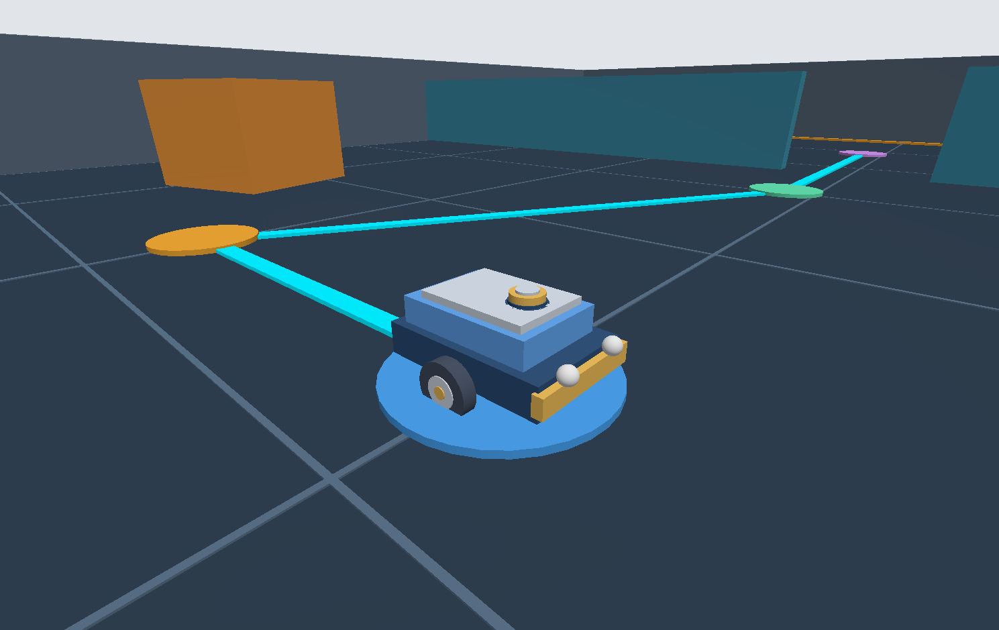
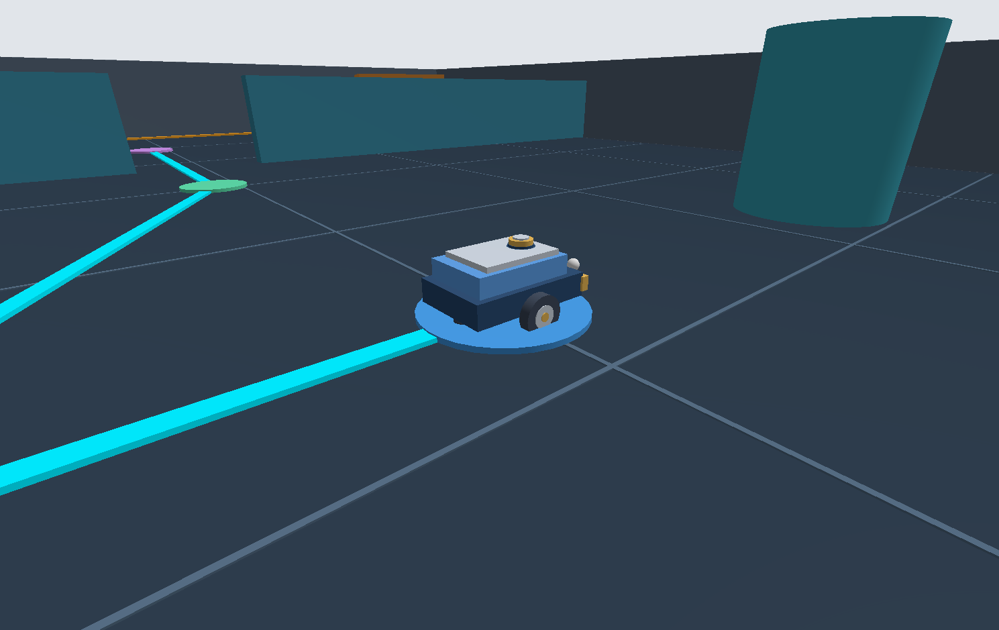
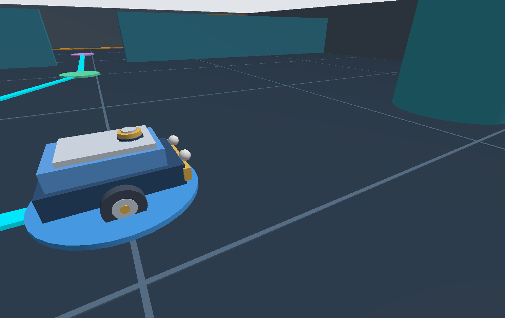
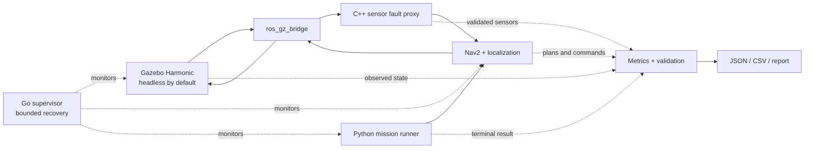
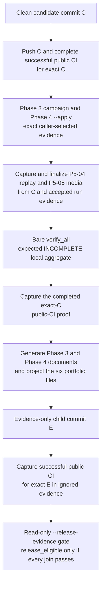

<div align="center">

# RoboTest Lab

### ROS 2 navigation reliability testbench

**Controlled sensor faults · Independent metrics · Reproducible evidence**


[](https://github.com/Hasan-Al-Hussein/robotest-lab/actions/workflows/robotest-ci.yml)
[](LICENSE)

[Why it exists](#why-this-is-more-than-a-robot-demo) ·
[See the lab](#genuine-gazebo-views) · [Engineering](#engineering-surface) ·
[Pipeline](docs/pipeline.md) · [Demo guide](docs/demo-script.md) ·
[Verification](#phase-1-verification)

</div>

<div align="center">
  <a href="docs/showcase/robotest-test-bay-hero.png"></a>
  <br />
  <sub>Genuine Gazebo capture. Route and waypoint markers are presentation geometry; engineering results come from logged runs, not the screenshot.</sub>
</div>

RoboTest Lab is a software-in-the-loop reliability testbench for a small
differential-drive robot. It runs a complete ROS 2 Jazzy navigation stack in
Gazebo Harmonic, introduces controlled sensor faults at an explicit validation
boundary, measures behavior independently, and preserves machine-readable
evidence for every bounded result.

## Why this is more than a robot demo

A robot moving once proves very little. A useful test platform must also answer:
Did the mission finish? Did sensor data remain valid? What changed during a
dropout or drift fault? Did the process stay within resource limits? Can another
engineer reproduce the outcome?

RoboTest connects those questions to concrete engineering controls:

| Reliability challenge | RoboTest response |
| --- | --- |
| Sensor behavior changes during a run | C++ validation and fault proxy for deterministic LiDAR dropout and planar odometry drift |
| Navigation can appear successful while measurements are biased | Observer-only collectors for ground truth, TF, odometry, scans, plans, commands, contacts, lifecycle state, and resources |
| A screenshot cannot prove a result | Canonical JSON/CSV, source and configuration binding, SHA-256 manifests, and bounded verifiers |
| Robot processes fail in different ways | Go supervisor with owned process groups, bounded restart policy, systemd integration, and Debian packaging |

## A run, end to end

**Gazebo** simulates the robot and sensors → an allowlisted **ROS–Gazebo
bridge** carries raw data → the **fault proxy** validates or alters sensors →
**AMCL and Nav2** localize, plan, and control → a bounded **mission runner**
sends ordered waypoints → independent **metrics** record the outcome →
verification binds the result to its source and configuration.

The [code-connected pipeline](docs/pipeline.md) traces every stage to its main
source file. The [demo guide](docs/demo-script.md) provides a visual inspection,
a moving waypoint demonstration, and the bounded development verifier.

## Genuine Gazebo views

<table>
  <tr>
    <td width="50%" align="center">
      <a href="docs/showcase/robotest-test-bay-wide.png"></a><br />
      <sub><strong>Test-bay context</strong> — route, waypoints, dividers, and obstacle geometry.</sub>
    </td>
    <td width="50%" align="center">
      <a href="docs/showcase/robotest-rover-close.png"></a><br />
      <sub><strong>Rover detail</strong> — Xacro model, differential drive, bumper, headlights, and LiDAR assembly.</sub>
    </td>
  </tr>
</table>

These are genuine simulator captures for presentation and inspection. They do
not replace the action result, metric files, manifests, or acceptance checks.

## Engineering surface

| Layer | What is implemented |
| --- | --- |
| Simulation | Original Xacro differential-drive robot, Gazebo Harmonic world, LiDAR, IMU, odometry, contact observation, and explicit `ros_gz_bridge` allowlist |
| Autonomy | ROS 2 Jazzy, Nav2, AMCL, TF2, lifecycle-managed startup, collision monitoring, velocity smoothing, and `FollowWaypoints` action ownership |
| Faults and measurement | Deterministic LiDAR dropout and odometry drift; observer-only navigation, localization, path, safety, recovery, and resource metrics |
| Runtime control | Bounded Python mission and scenario orchestration plus a Go process supervisor with process-group recovery |
| Delivery and proof | Colcon/ament, Pytest, Ruff, Debian packaging, systemd, canonical JSON/CSV, SHA-256 manifests, and GitHub Actions gates |

## Evidence at a glance

| Demonstrated result | Recorded evidence | Scope |
| --- | --- | --- |
| Robot, sensor boundary, and headless runtime | [103-test development result](docs/results/phase-1/20260825T200725Z-1333.md) with measured real-time factor and resource use | Bounded development evidence |
| Ordered Nav2 waypoint mission | [3/3 waypoint development result](docs/results/phase-2/20260826T010218Z-466.md), matching JSON/CSV, and independent post-run audit | Bounded seeded mission evidence |
| Fault campaigns and metrics | LiDAR dropout, odometry drift, scenario orchestration, collection, analysis, and aggregation are implemented and statically verified | No completed 15-run campaign is claimed |
| Recovery and packaging | Go supervision, systemd, Debian packaging, and lifecycle verification surfaces are implemented and statically verified | No privileged lifecycle acceptance is claimed |

<!-- ROBOTEST_RELEASE_STATUS_START -->
## Final acceptance status

At the last verified baseline (`14529a6`), the local and hosted non-live CI
gates passed. The latest one-shot live smoke (`phase3-14529a6-001`) met the
frozen real-time-factor thresholds, but navigation aborted at waypoint 1.

No 15-run campaign, privileged lifecycle acceptance, or final release
qualification is claimed.
<!-- ROBOTEST_RELEASE_STATUS_END -->

This boundary is intentional: static or visual success is never promoted into
a runtime or release claim. The detailed development evidence and reproducible
commands remain below for reviewers who want to audit the result.

## Technology

| Layer | Main components |
| --- | --- |
| Simulation | Gazebo Harmonic, original SDF world, Xacro robot, `ros_gz_bridge` |
| Robotics | ROS 2 Jazzy, Nav2, AMCL, TF2, lifecycle nodes, ROS actions |
| Runtime code | C++17 sensor and contact components, Python 3.12 mission and evidence tooling, Go 1.22 supervisor |
| Verification | Colcon and ament, Pytest, Ruff, schema validation, canonical JSON/CSV, SHA-256 manifests |
| Delivery | Debian package, systemd unit, WSL2 Ubuntu 24.04, GitHub Actions release gates |

## Verified platform boundary

- Target environment: the WSL2 distribution named `Ubuntu`, verified as
  Ubuntu 24.04.1 LTS (Noble).
- Preserved environment: `Ubuntu-20.04` is out of scope and must never be
  changed by project scripts.
- Project root: `/home/hasan/robotest-lab` on the WSL-native filesystem.
- Runtime target: ROS 2 Jazzy, Gazebo Harmonic, Nav2, C++17, Python 3.12, and
  Go 1.22 or newer.
- Resource policy: headless by default, no GPU requirement, no Docker in the
  core workflow, at most 18 GiB projected project/dependency storage, and at
  least 20 GiB projected free space retained on the Windows host drive.

The [environment audit](docs/environment-audit.md),
[dependency plan](docs/dependencies.md),
[Phase 1 result](docs/results/phase-1/20260825T200725Z-1333.md), and
[Phase 2 result](docs/results/phase-2/20260826T010218Z-466.md) distinguish
measured evidence from planned work.

## Architecture

<!-- ROBOTEST_PORTFOLIO_DIAGRAM: architecture -->


This diagram describes the implemented design. The Phase 1 and Phase 2 results
remain limited to their documented development scopes; they do not imply that
the later campaign, supervisor, packaging, or public-CI acceptance gates ran.

The release path keeps runtime evidence, tracked projections, public-CI proof,
and the final decision separate:

<!-- ROBOTEST_PORTFOLIO_DIAGRAM: release-flow -->


P5-05 treats a run-derived chart and a screenshot as different evidence. The
release portfolio chart must be a byte-identical projection of an accepted
Phase 3 Scenario 5 `runs/12` `localization-error.png`, joined to its run ID,
manifest, candidate SHA, and canonical PASS result. The existing
[Phase 1 RViz image](docs/results/phase-1/rviz-phase1.png) is a genuine manual
screenshot from a separate development run; it is not a benchmark chart and
cannot substitute for the Phase 3 artifact. The exact capture and projection
order is documented in the
[Phase 5 CI gate](docs/testing/phase5-ci.md#documentation-replay-and-portfolio-media).

## Phase 0 workflow

Run these commands only inside the verified Ubuntu 24.04 distribution. The
repository and dependency scripts reject Ubuntu 20.04.

The repository-source check is read-only. It is expected to fail until the
pinned official ROS source package has been applied.

```bash
cd /home/hasan/robotest-lab
scripts/setup_ros2_repository.sh --check
```

The first mutating setup step requires explicit authorization and the literal
`--apply` flag:

```bash
cd /home/hasan/robotest-lab
scripts/setup_ros2_repository.sh --apply
```

Simulate the exact manifest and enforce storage/reserve gates before installing
anything:

```bash
cd /home/hasan/robotest-lab
scripts/verify_phase0_preinstall.sh
```

Install the validated manifest, initialize rosdep, create the local tooling
environment, and run the post-install verifier only with explicit
authorization:

```bash
cd /home/hasan/robotest-lab
scripts/install_dependencies.sh --apply
```

The post-install Phase 0 verifier is repeatable and read-only:

```bash
cd /home/hasan/robotest-lab
scripts/verify_phase0.sh
```

The bare aggregate is also read-only. It intentionally exits `3`
(`INCOMPLETE`) until exact caller-selected release evidence is validated
separately:

```bash
cd /home/hasan/robotest-lab
scripts/verify_all.sh
```

Machine-readable Phase 0 results are written below
`artifacts/evidence/phase0/`. Generated evidence records what actually ran;
it must not be edited to manufacture a passing result.

## Phase 1 verification

Run the bounded automated gate inside the verified Ubuntu distribution:

```bash
cd /home/hasan/robotest-lab
taskset -c 0-5 scripts/verify_phase1.sh
```

The seeded development run `20260825T200725Z-1333` passed its build, model,
headless runtime, topic/QoS, stamp, trace, motion, resource, and artifact-hash
checks with `simulator_seed=42` and seed status
`fixed_simulator_seed_recorded`. Headline observations were 103 tests with zero
errors or failures, calculated RTF median `0.9999`, calculated RTF p5 `0.9162`,
peak launch-group RSS `795,476 KiB`, and bounded displacement `0.2962 m`. Ten
checks were skipped because `ament_cppcheck` declines cppcheck 2.13 for its
known performance issue.

Evidence:

- [full Phase 1 report](docs/results/phase-1/20260825T200725Z-1333.md)
- [compact canonical JSON](docs/results/phase-1/20260825T200725Z-1333.json)
- [matching one-row CSV](docs/results/phase-1/20260825T200725Z-1333.csv)
- [separate P1-07 RViz screenshot](docs/results/phase-1/rviz-phase1.png)

The 45-entry run checksum manifest validated completely. The headless run was
made from a dirty worktree and the RViz evidence came from a separate bounded
run, so neither is presented as a release benchmark. Fast DDS exposed live
reliability and durability but reported endpoint history/depth as
`UNKNOWN`/`0`; bounded depths retain static/source-and-test support. The contact
topic was silent, so collision absence is not established. Live TF endpoint and
edge sets were recorded, but per-edge publisher-GID attribution was unavailable.

## Phase 2 verification

Run the bounded, headless mission/action gate inside the verified Ubuntu
distribution:

```bash
cd /home/hasan/robotest-lab
ROBOTEST_SIM_SEED=42 ROBOTEST_CPUSET=0-5 scripts/verify_phase2.sh
```

The development run `20260826T010218Z-466` passed the scoped Phase 2 gate with
seed `42`, six logical CPUs (`0-5`), an empty fault schedule, and software
rendering through `llvmpipe`. Nav2 returned `SUCCEEDED` after all three ordered
waypoints. The authoritative UUID-matched action-status acceptance stamp was
`68.308 s`; the Jazzy `rclcpp_action` response stamp was retained separately as
zero/unavailable, and the terminal observation was `156.994 s`.

Headline observations were 213 tests with zero errors and failures, calculated
RTF median `0.9863`, calculated RTF p5 `0.9302`, and peak owned-process-group
RSS `1,372,244 KiB`. All 111 checksum-manifest entries validated. Source/install
binding, source/configuration non-mutation, bounded process cleanup, mission
JSON/CSV reconciliation, action ownership, command/ground-truth correlation,
and an independent post-run evidence audit passed.

Evidence:

- [full Phase 2 report](docs/results/phase-2/20260826T010218Z-466.md)
- [compact canonical JSON](docs/results/phase-2/20260826T010218Z-466.json)
- [matching one-row CSV](docs/results/phase-2/20260826T010218Z-466.csv)

This is bounded mission/action acceptance, not full Scenario 1 acceptance. The
dirty worktree makes it development evidence only. Fault injection and recovery
were not exercised by that Phase 2 run; their authoritative acceptance, along
with collision count, path length, path efficiency, and repeated-run evidence,
remains in the separate Phase 3 gate. Fast DDS
reported live history/depth as `UNKNOWN`/`0`; bounded queues retain static
source-and-test proof. Required TF edges and endpoint sets were observed, but
Jazzy callbacks did not provide per-edge publisher-GID attribution.

## Phase 3-5 static gates

These commands exercise source, build, unit, policy, and short non-live checks.
They do not authorize the Phase 3 campaign, the privileged Phase 4 lifecycle
run, GitHub publication, or a release verdict.

```bash
cd /home/hasan/robotest-lab
taskset -c 0-5 scripts/verify_phase3.sh
```

```bash
cd /home/hasan/robotest-lab
taskset -c 0-5 scripts/verify_phase4.sh
```

```bash
cd /home/hasan/robotest-lab
scripts/verify_phase5.sh --local
```

The Phase 3 campaign and Phase 4 `--apply` run have explicit authorization,
clean-source, and evidence-binding requirements. Follow the canonical commands
and order in the [verification matrix](docs/testing/verification-matrix.md),
then use the [Phase 5 CI gate](docs/testing/phase5-ci.md) for candidate and
evidence-commit proof. A successful static gate is not runtime or release
acceptance.

## Safety properties of setup

- Mutating setup scripts require an explicit `--apply` argument.
- The apt manifest is parsed as literal package-name arguments; shell
  evaluation and `xargs` interpolation are not used.
- The ROS apt-source package is pinned and SHA-256 verified before installation.
- Dependency installation is blocked if projected usage exceeds 18 GiB or
  would leave less than 20 GiB free on the Windows host drive.
- No script unregisters, exports, imports, terminates, or changes the default
  of any WSL distribution.

## Roadmap and evidence gates

<!-- ROBOTEST_RELEASE_ROADMAP_START -->
| Phase | Status | Deliverable and gate |
| --- | --- | --- |
| 0 | Verified locally | Environment foundation, exact install manifest, versions, and resource gates |
| 1 | Verified development | Original robot/world, pass-through proxy, headless gates, and separate RViz evidence |
| 2 | Verified development | Bounded seeded Nav2 mission/action result, command chain, matching JSON/CSV, and global resource/isolation gates |
| 3 | Implemented; authoritative status is the bounded final-status block | Repeatable LiDAR-dropout and odometry-drift campaigns with metrics |
| 4 | Implemented; authoritative status is the bounded final-status block | Go supervisor, systemd and Debian package with lifecycle proof |
| 5 | Static-ready; authoritative status is the bounded final-status block | Public CI and portfolio evidence on a documented clean commit |
<!-- ROBOTEST_RELEASE_ROADMAP_END -->

## Repository layout

```text
src/                 ROS 2 packages
supervisor/          Go supervisor
scenarios/           Versioned mission and fault scenarios
config/              Shared manifests and resource policy
scripts/             Setup and evidence-producing verification
packaging/debian/    Debian packaging
tests/               Cross-package and system tests
benchmarks/          Benchmark definitions and bounded outputs
docs/                Architecture, decisions, testing, and results
artifacts/evidence/  Machine-readable verification evidence
```

## Documentation map

- [Pipeline guide](docs/pipeline.md) explains the complete robot loop in plain
  language and connects every stage to its main source files.
- [Demo guide](docs/demo-script.md) covers the two-minute RViz inspection, the
  optional moving presentation, and the bounded Phase 2 development gate.
- [Architecture contracts](docs/architecture/metrics-contract.md) define the
  evidence and metric semantics.
- [Acceptance criteria](docs/testing/acceptance-criteria.md) freeze pass/fail
  targets; the [verification matrix](docs/testing/verification-matrix.md) maps
  each target to proof.
- [Troubleshooting](docs/troubleshooting.md) preserves failed evidence and
  diagnoses the first failing layer.
- [Case study](docs/case-study.md) explains the engineering choices and the
  current evidence boundary.
- [Portfolio notes](docs/portfolio.md) preserve source-linked Phase 1 and Phase
  2 development bullets and condition every later-phase claim on the exact
  final release gate.
- [Phase 5 CI and release order](docs/testing/phase5-ci.md) defines local CI,
  public proof, documentation replay, genuine-media projection, and the final
  read-only decision.

## Contributing and security

See [CONTRIBUTING.md](CONTRIBUTING.md) for the evidence-first development
workflow and [SECURITY.md](SECURITY.md) for the local-only security boundary.

## License

Original RoboTest Lab code is licensed under the
[Apache License 2.0](LICENSE). Third-party software retains its own license;
see [NOTICE.md](NOTICE.md).
