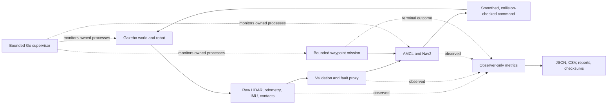

# RoboTest Lab pipeline

[Back to the project overview](../README.md) | [Run the demo](demo-script.md) |
[Read the case study](case-study.md)

## In one sentence

RoboTest Lab runs an autonomous robot in simulation, controls exactly which
sensor data reaches navigation, executes a bounded mission, measures the result
independently, and records enough evidence to decide whether the run passed.

## The problem it solves

A robot moving on screen does not prove that its software is reliable. A useful
test system must also answer:

- Which source and configuration produced this run?
- Did the robot finish the intended mission?
- Were the sensor, transform, action, and command paths the expected ones?
- Did the result stay inside safety, timing, resource, and cleanup bounds?
- Can a failure be reproduced without silently reusing warm state?

RoboTest makes those questions part of the software. Simulation, control, and
evidence are connected, but the component that judges a run is kept separate
from the component that drives the robot.

## The complete flow

The solid arrows form the robot control loop. The dotted arrows show observation
and recovery boundaries. Metrics do not publish goals, velocity commands, fault
commands, or lifecycle transitions.

## Stage by stage

| Stage | What happens in simple words | Main implementation |
| --- | --- | --- |
| 1. Describe the robot | Xacro defines the body, wheels, inertial properties, sensors, frames, and collision geometry. | [`robotest.urdf.xacro`](../src/robotest_description/urdf/robotest.urdf.xacro) and the package [model guide](../src/robotest_description/README.md) |
| 2. Start the world | Gazebo loads the original test world, spawns the robot, advances simulation time, and produces sensor and contact data. | [`robotest_lab.sdf`](../src/robotest_sim/worlds/robotest_lab.sdf) and [`sim.launch.py`](../src/robotest_sim/launch/sim.launch.py) |
| 3. Cross the ROS boundary | An explicit allowlist bridges only reviewed Gazebo topics and services into ROS 2. | [`bridge.yaml`](../src/robotest_sim/config/bridge.yaml) |
| 4. Validate or alter sensors | The always-present C++ proxy passes valid data through normally. For a scheduled Phase 3 test, it can apply bounded LiDAR dropout or planar odometry drift. | [`fault_proxy_node.cpp`](../src/robotest_faults/src/fault_proxy_node.cpp) and the [fault protocol](../src/robotest_faults/README.md) |
| 5. Localize and plan | AMCL estimates the pose on the generated map. Nav2 plans and follows a route using only validated inputs. | [`phase2.launch.py`](../src/robotest_navigation/launch/phase2.launch.py), [`nav2_params.yaml`](../src/robotest_navigation/config/nav2_params.yaml), and the [navigation contract](../src/robotest_navigation/README.md) |
| 6. Send one mission | A bounded Python action client validates the mission file, sends one `FollowWaypoints` goal, watches the exact action UUID, and handles timeout or cancellation. | [`mission_runner.py`](../src/robotest_missions/robotest_missions/mission_runner.py), [`phase2_baseline.yaml`](../scenarios/phase2_baseline.yaml), and the [mission contract](../src/robotest_missions/README.md) |
| 7. Observe independently | Collectors retain bounded prefixes of ground truth, TF, odometry, scans, plans, commands, contacts, faults, and lifecycle state. | [`collector_node.py`](../src/robotest_metrics/robotest_metrics/collector_node.py) and the [metrics guide](../src/robotest_metrics/README.md) |
| 8. Decide and package evidence | Pure analysis computes the required metrics, writes one canonical result, reconciles JSON and CSV, and binds reports with a checksum manifest. | [`analysis.py`](../src/robotest_metrics/robotest_metrics/analysis.py) and [`artifacts.py`](../src/robotest_metrics/robotest_metrics/artifacts.py) |
| 9. Bound recovery | The Go supervisor owns process groups, restart budgets, state, and health surfaces. Debian and systemd files define the installed lifecycle. | [`manager.go`](../supervisor/internal/supervisor/manager.go), [`restart.go`](../supervisor/internal/supervisor/restart.go), and [`packaging/debian`](../packaging/debian) |
| 10. Verify the claim | Phase scripts check source binding, runtime behavior, resources, isolation, cleanup, artifacts, CI proof, and final release eligibility. | [`scripts`](../scripts), [acceptance criteria](testing/acceptance-criteria.md), and the [verification matrix](testing/verification-matrix.md) |

## A simple concrete mission

The Phase 2 baseline starts the robot at `(0.0, -3.5)` and asks it to visit
three map positions in order:

1. `(-2.0, -3.5)`
2. `(0.0, 0.0)`
3. `(0.0, 3.5)`

Here is what happens during that one mission:

1. Gazebo publishes a laser scan and simulated motion data.
2. The bridge maps those streams to private raw ROS topics.
3. The fault proxy validates the messages and publishes the sensor topics used
   by navigation. The Phase 2 baseline has no fault schedule.
4. AMCL combines the map, transforms, scan, and odometry to estimate the robot
   pose.
5. Nav2 plans from the current pose to the first waypoint.
6. The controller publishes velocity commands through the smoother and
   collision monitor before the Gazebo bridge actuates the robot.
7. New sensor readings close the loop. Nav2 replans or adjusts commands as the
   robot moves.
8. The waypoint follower advances only after the current point succeeds.
9. The mission runner receives the exact terminal action result and writes a
   reconciled JSON and CSV pair.
10. The verifier checks the mission, action ownership, transforms, QoS,
    resources, cleanup, and artifact hashes before it reports success.

The recorded Phase 2 development run reached all three waypoints. Its result is
useful development evidence, but it is not a final release benchmark because it
came from a dirty worktree and does not evaluate the full Phase 3 metric set.

## How fault testing extends the same loop

Phase 3 keeps the same basic robot loop and adds five versioned scenarios:

| Scenario | Test idea |
| ---: | --- |
| 1 | Baseline navigation |
| 2 | Deterministic static obstacle and replan |
| 3 | Deterministic moving obstacle |
| 4 | Temporary LiDAR dropout |
| 5 | Deterministic odometry drift |

Each scenario is designed for three cold repetitions, producing a 15-run
campaign. The proxy does not randomly damage data. The mission preloads a
versioned schedule, binds it to the accepted action UUID and simulation stamp,
and then arms it. Observer-only metrics compare the commanded mission with
ground truth and the expected fault window.

Those campaign surfaces are implemented and statically verified. Their runtime
acceptance is controlled by the bounded final-status block in the
[root README](../README.md) and the exact 15-run evidence named there; this
pipeline guide does not make that decision.

## Control path versus evidence path

This separation is the most important design choice:

- The **control path** decides where the robot should move.
- The **fault path** decides whether reviewed sensor transformations are active.
- The **evidence path** observes both without controlling either one.
- The **verifier** rejects missing, stale, oversized, inconsistent, dirty, or
  unbound evidence.

That structure reduces the chance that the same component can create a result
and then approve its own work.

## How to interpret the evidence

| Area | Current status |
| --- | --- |
| Phase 0 environment | Verified locally on the documented Ubuntu 24.04 WSL2 target |
| Phase 1 robot, world, sensors | Bounded development verification recorded |
| Phase 2 waypoint mission | Bounded development verification recorded |
| Phase 3 campaign | Implementation and static verification are separate from the authoritative runtime status in the root README |
| Phase 4 supervisor and package lifecycle | Implementation and static verification are separate from the authoritative privileged status in the root README |
| Phase 5 release | The exact read-only release decision and public-CI proof determine the authoritative status in the root README |

For exact commands, source hashes, measurements, and caveats, continue with the
[root README](../README.md), [Phase 1 report](results/phase-1/20260825T200725Z-1333.md),
[Phase 2 report](results/phase-2/20260826T010218Z-466.md), or
[demo guide](demo-script.md).
