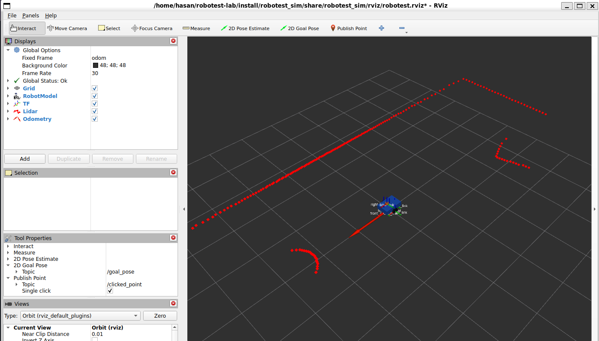

# Phase 1 Seeded Verified-Development Result: `20260825T200725Z-1333`

The bounded Phase 1 headless verifier exited successfully on 2026-08-25. This
is local development evidence, not release or benchmark evidence: the run was
made from Git commit `d40625c954533e9a3fe38b1107cd11b2331da214` with a dirty
worktree. P1-07 was performed separately in RViz and is documented below.

## Reproduce the automated gate

```powershell
wsl -d Ubuntu -- bash -lc 'cd /home/hasan/robotest-lab && ROBOTEST_SIM_SEED=42 taskset -c 0-5 scripts/verify_phase1.sh'
```

The run recorded the effective script argv, caller and workspace directories,
Git state, source/configuration hashes, target and scenario hashes, dependency
versions, CPU affinity, ROS domain `133`, and Gazebo partition
`robotest_phase1_20260825T200725Z_1333`. Both the effective parameters and the
scenario provenance record numeric `simulator_seed=42`; the canonical seed
status is `fixed_simulator_seed_recorded`. Fault and mission seeds are null
because Phase 1 exercises only the no-fault pass-through scenario.

Compact tracked projections are available as
[JSON](20260825T200725Z-1333.json) and [CSV](20260825T200725Z-1333.csv). The
CSV contains exactly one row and matches the scalar projection of the JSON.

## Automated result

| Gate | Target | Observation | Result |
| --- | --- | --- | --- |
| Process and evidence | Exit zero; valid artifact hashes | Verifier, tee, runtime probe, and checksum validation exited zero; all 45 manifest entries validated | Pass |
| Deterministic input | Fixed and recorded simulator seed | Numeric seed `42`; status `fixed_simulator_seed_recorded` in provenance, JSON, and CSV | Pass |
| Build and model | Four-worker build; valid URDF/SDF | Four packages built in 2.76 s; `check_urdf` succeeded; `gz sdf -k` reported valid | Pass |
| Tests | No errors or failures | 103 tests, 0 errors, 0 failures, 10 skipped cppcheck checks | Pass with stated skip |
| Headless runtime | Advancing `/clock`; simulation time on participating nodes | Gazebo, bridge, proxy, and robot-state publisher ran headlessly; all checked nodes used simulation time | Pass |
| Bounded motion | Nonzero displacement followed by zero command | `0.29619887895167835 m`; 20 motion commands followed by 10 recorded zero commands | Pass |
| Peak launch-group RSS | At most 6 GiB (`6,291,456 KiB`) | `795,476 KiB` (`776.83 MiB`) | Pass |
| Calculated RTF median | At least `0.80` | `0.9999416661302953` | Pass |
| Calculated RTF p5 | At least `0.50` | `0.9162105536383762` | Pass |

The ten skips are the package-level `ament_cppcheck` checks that decline
cppcheck 2.13 because of its known performance issue. They are version-policy
skips, not test failures.

The RTF result uses five non-overlapping windows drawn from 30 post-warmup
world-statistics samples. Gazebo's separately retained reported RTF had median
`0.9997485832434972` and p5 `0.9088595630203221`; it is not substituted for
the calculated gate.

Resource sampling covered the isolated launch process group from the first
sample immediately after PGID validation through controlled launch-leader
shutdown. The small process-creation-to-first-sample interval was not observed
and is labeled as such in `summary.json` and `resource-summary.txt`. Shutdown
used TERM and did not require the bounded KILL fallback.

## Data plane, QoS, and timestamps

| Stream | Raw simulation rate | Validated simulation rate | Paired semantic matches | Mismatches |
| --- | ---: | ---: | ---: | ---: |
| LiDAR | `5.0 Hz` | `5.0 Hz` | 90 | 0 |
| Odometry | `20.0 Hz` | `20.0 Hz` | 358 | 0 |
| IMU | `46.87854710556186 Hz` | `46.82179341657208 Hz` | 817 | 0 |

The live reliability and durability of every inspected publisher and
subscriber matched the Phase 1 expectations, including `/clock`, raw and
validated sensor topics, `/robotest/cmd_vel`, `/robotest/faults/events`,
validation topics, `/tf`, and `/tf_static`. The runtime probe found no QoS
contract mismatch.

Fast DDS graph introspection on Jazzy reported `history=UNKNOWN` and `depth=0`
for the live endpoints. Therefore live introspection did **not** prove bounded
depths. Bounded `KEEP_LAST` depths are instead supported by bridge and proxy
source configuration plus structural and unit tests; this limitation remains
explicit in the runtime JSON.

Stamp evidence was persisted for raw and validated scan, odometry, IMU, and
ground truth. Every checked stream had zero stamp regressions and zero duplicate
stamps. Maximum forward gaps were `0.20 s` for scan, `0.05 s` for odometry and
ground truth, and `0.08 s` for IMU, all within their declared limits. Receipt
age and final-age gates also passed.

## Motion and TF evidence

The bounded trace retained 20 forward commands, 10 final-zero commands, and 61
ground-truth pose samples without trace drops. Ground-truth x moved from
approximately zero to `0.29619887894993346 m`; its last ten recorded x values
were unchanged after the final-zero sequence. The measured motion-command rate
was `9.692385546783104 Hz`, with a minimum wall interval of
`0.10019717298564501 s`.

Observed dynamic TF edges were:

- `base_link -> left_wheel_link`
- `base_link -> right_wheel_link`
- `odom -> base_footprint`

Observed static edges were:

- `base_footprint -> base_link`
- `base_link -> front_caster_link`
- `base_link -> rear_caster_link`
- `base_link -> lidar_link`
- `base_link -> imu_link`

The live graph contained the expected `/tf` publishers—the fault proxy and
robot-state publisher—and only the robot-state publisher on `/tf_static`.
Jazzy `rclpy` callbacks did not expose publisher GIDs, so the probe could not
attribute each received TF edge to one live publisher. Endpoint enumeration,
source structure, and unit tests provide the ownership evidence; per-edge live
publisher-GID attribution is not claimed.

## Contacts and rendering

The contacts endpoint existed, but the contact topic was silent during this
bounded run (`nonempty_contact_messages=0`). That does **not** establish
collision absence, and no collision-free result is claimed.

The run-local OGRE log records OGRE `2.3.3`, a Mesa software EGL device,
`llvmpipe (LLVM 20.1.2, 256 bits)`, and loading of the GPU-rays material and
compositor. It also records an initialization-time texture-memory stall. The
headless sensor and performance gates passed, but this is evidence of software
rendering, not hardware acceleration.

## Separate seeded P1-07 RViz inspection

P1-07 used the separate bounded run `rviz-20260825T200856Z-2873`, simulator
seed `42`, ROS domain `213`, and Gazebo partition
`robotest_phase1_rviz_20260825T200856Z_2873`. The cropped RViz-only screenshot
was captured at `2026-08-25T20:09:40.8476723Z` and visually reviewed at
`2026-08-25T20:11:08.3828288Z`.

The persisted `visual-review.txt` and `inspection-summary.json` record a pass:
Global Status was Ok, the fixed frame was `odom`, and RobotModel, TF, LiDAR,
and Odometry were visible. LiDAR returns were visibly aligned with the walls.



The tracked cropped screenshot SHA-256 is
`ef98096fc2999a7d85d614cfbe0a777d09db9aacbedd45279a1a91c9e4a8858d`.
The visual run recorded simulation-launch hash
`6d8b17a684f2d00127c001a07a199aa8a2563514fb7b67d834da70a430e3884c`
and RViz-config hash
`28b4d3e3928c986019baed6a7e54edb2f16185dfdbd75c339ffd9b2cf963b75c`.
The uncropped desktop capture remains ignored raw evidence and is deliberately
not linked. This visual run is separate from the headless performance run,
whose compact JSON correctly retains `manual_rviz_status=PENDING`.

## Evidence integrity and provenance

`SHA256SUMS` contains 45 entries. The persisted checksum sidecar contains 45
matching `OK` lines, including the finalized `verify.log` and `summary.json`.
The manifest itself has SHA-256
`157c102d105f1ae9828fccaff81808a076eca1249b1f9e6abbc437c242ded5f2`.

| Evidence | Run-local SHA-256 |
| --- | --- |
| `run-result.json` | `6dc8e9632d4a3200b67100f673e2fdda1d23c95317a0156e973b452c4689a424` |
| `run-result.csv` | `2e10e4a7c764b21967e10bb2fadf98f06b8e74f0df37772f4d33ba74b4e83e90` |
| `runtime-probe.json` | `aba1d986fe01a3689dc9760dcdead1b92e3577bfa00ebf5d99824cac2d4767a0` |
| `resources.csv` | `924e4dcae93baeb60a8e224ad84a296e5950a1d960a82a88d5ea63bd981b6ba1` |
| `provenance.json` | `267a106118bcd9c5e25b1a3e784854956bd33a30301215cd7c3b1acc6d39c1ee` |
| `source-config-hashes.json` | `2702344a018afa174a86d6e7790ba159a4f852d2a076daf39bd073a4ef133e84` |
| `verify.log` | `fdb32e30b6aaf45f33eae67d0500fc13f161c3a84b2ad6b53e9d6c6f4e2b7d14` |
| `summary.json` | `8d19462318e812e5c39328a474e10978c7e3aa902b35d18291f7fa2756997cf2` |

The pre-run aggregate source/configuration hash was
`d8d7eb770ec9ff39f87e4162cb838e1d10ae3f215fe6c383249afccc0fa58da1`.
The frozen target-set hash was
`32ed12de9b2a3235fb83f833760454ee57ab066748318c0e771b5bf44cf7e9a1`;
the world/scenario hash was
`cb800041e2a47baaefa74d4c0bd82bcd1c09c67a315351e11ef4fe8231a493e6`.

The tracked JSON is byte-identical to the run-local compact JSON. The tracked
CSV is LF-normalized for the repository and has SHA-256
`6d7bc9e2e0559f82341ff65629d3e6f260b162360a8f7e862b2d2695f4c787fd`;
its header and single row match the run-local CSV and the JSON projection.

## Scope

This result verifies the local Phase 1 robot/world, seeded simulation with a
pass-through proxy, bounded motion, graph, QoS fields visible through Fast DDS,
stamps, traces, resources, and headless software rendering. It does not verify Nav2,
autonomous missions, fault modes beyond pass-through, repeated-run stability,
collision absence, hardware rendering, public CI, release packaging, or
release reproducibility.
